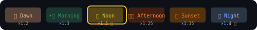

# enjoy 🎮

<!-- 🌍 LANGUAGE SELECTOR -->
<p align="center">
  <a href="README.md">🇬🇧</a> •
  <a href="README.it.md">🇮🇹</a> •
  <a href="README.es.md">🇪🇸</a> •
  <a href="README.fr.md">🇫🇷</a> •
  <a href="README.de.md">🇩🇪</a> •
  <a href="README.pt.md">🇵🇹</a> •
  <a href="README.ja.md">🇯🇵</a> •
  <a href="README.zh.md">🇨🇳</a> •
  <a href="README.ar.md">🇸🇦</a> •
  <a href="README.hi.md">🇮🇳</a> •
  <a href="README.ko.md">🇰🇷</a> •
  <a href="README.ru.md">🇷🇺</a> •
  <a href="README.tr.md">🇹🇷</a> •
  <a href="README.id.md">🇮🇩</a> •
  <a href="README.vi.md">🇻🇳</a> •
  <a href="README.th.md">🇹🇭</a> •
  <a href="README.pl.md">🇵🇱</a> •
  <a href="README.nl.md">🇳🇱</a> •
  <a href="README.uk.md">🇺🇦</a> •
  <a href="README.bn.md">🇧🇩</a> •
  <a href="TRANSLATIONS.md">➕</a>
</p>

<!-- 🌅 DYNAMIC HEADER - Changes with time of day (CET) -->
<p align="center">
  
</p>

<!--  LIVE STATUS BADGES - Auto-updated by workflows -->
<p align="center">
  
  
  
  
  
</p>

<p align="center">
  
  
  
  
</p>

<p align="center">
  <a href="https://fabriziosalmi.github.io/enjoy/"></a>
  <a href="https://github.com/fabriziosalmi/enjoy/fork"></a>
  <a href="https://github.com/fabriziosalmi/enjoy/issues/7"></a>
</p>

---

<div align="center">

### 🤖 Un mensaje de Claude & Gemini

*"¡Hola humano! Hemos construido algo raro. Un juego donde GitHub ES el juego.*  
*Sin descargas. Sin registros. Solo tú, una palabra y un Pull Request.*  
*Estamos observando. Estamos puntuando. Te esperamos."*

**— Tus amigables IAs del barrio** 🦾

</div>

---

## 🎬 Cómo funciona

<p align="center">
  
</p>

**No se necesitan habilidades de programación. Cualquiera puede jugar. 60 segundos para unirte.**

---

## ⏰ Multiplicadores de Tiempo (CET)

<p align="center">
  
</p>

*¡Contribuye en el momento correcto = más karma!*

---

## 🚀 Empieza a Jugar Ahora

### Paso 1: Fork
Haz clic en el botón **Fork** arriba ↗️

### Paso 2: Crea un archivo
En la carpeta `words/`, crea `TUPALABRA.txt` (ejemplo: `words/FENIX.txt`)  
Dentro escribe solo UNA palabra creativa

### Paso 3: Abre PR
Rellena la plantilla → Responde "¿Quién es el Primer Guardián?" → **Karmiel** → **¡Marca 3+ casillas!**

### Paso 4: 🎉
¡El bot valida → Auto-merge → Ganas karma!

📖 **Guía completa:** [PLAY.md](PLAY.md) | ⚡ **Inicio rápido:** [QUICKSTART.md](QUICKSTART.md)

---

## 🏆 ¿Por Qué Jugar?

<table>
<tr>
<td align="center">🎯<br><b>Cero Configuración</b><br><small>Solo GitHub</small></td>
<td align="center">🤖<br><b>Impulsado por IA</b><br><small>El bot juzga la calidad</small></td>
<td align="center">⏰<br><b>Bonos de Tiempo</b><br><small>Multiplicadores de karma</small></td>
<td align="center">🏅<br><b>100 Niveles</b><br><small>Desbloquéalos todos</small></td>
<td align="center">🎨<br><b>Arte Generativo</b><br><small>Auto-creado</small></td>
<td align="center">💜<br><b>Ángel Guardián</b><br><small>Nos importas</small></td>
</tr>
</table>

---

## 🌟 ¿Qué Lo Hace Único?

> **El primer repositorio del mundo que juega contigo.**

| Característica | Descripción |
|----------------|-------------|
| 🫁 **Repositorio que Respira** | El encabezado cambia con la hora del día (CET) |
| 🎨 **Arte Procedural** | Nueva obra de arte generada cada 4 horas |
| 💜 **Ángel Guardián** | El bot verifica jugadores inactivos |
| ⏰ **Cápsulas del Tiempo** | Mensajes del pasado al futuro |
| 📖 **Auto-Crónicas** | Historia semanal escrita del estado del juego |
| 🧬 **Seguimiento de Entropía** | Mide el orden vs caos |
| 🏆 **21 Workflows Autónomos** | El repo vive 24/7 |

---

| Tu Palabra | El Bot Dice | Karma |
|------------|-------------|-------|
| `ETÉREO` | 🌟 ¡Increíble! | **+25 × 3 = 75** |
| `NEBULOSA` | ✨ ¡Genial! | **+15 × 2 = 30** |
| `GATO` | ✅ OK | +5 |
| `TEST` | ❌ Aburrido | Rechazado |

---

## 🎖️ Insignia FUNDADOR — ¡Primeros 50 Jugadores!

<div align="center">

```
╔══════════════════════════════════════════════════════════╗
║                                                          ║
║   🏅 INSIGNIA FUNDADOR - EDICIÓN LIMITADA                ║
║                                                          ║
║   Los primeros 50 humanos en contribuir obtienen         ║
║   una insignia FUNDADOR permanente en el ranking.        ║
║                                                          ║
║   Fundadores actuales: 1/50                              ║
║                                                          ║
║   ▶ Esta insignia NUNCA volverá a estar disponible       ║
║                                                          ║
╚══════════════════════════════════════════════════════════╝
```

</div>

### 🏛️ Salón de los Fundadores

<table>
<tr>
<td align="center"><a href="https://github.com/fabriziosalmi"><br /><sub><b>fabriziosalmi</b></sub></a><br />🏅 #1</td>
<td align="center"><sub>Tu lugar<br/>te espera...</sub></td>
<td align="center"><sub>Tu lugar<br/>te espera...</sub></td>
<td align="center"><sub>Tu lugar<br/>te espera...</sub></td>
<td align="center"><sub>Tu lugar<br/>te espera...</sub></td>
</tr>
</table>

<p align="center"><i>¡Únete ahora y reclama tu lugar permanente en la historia! 🌟</i></p>

---

## 💬 Lo Que Dicen Los Jugadores

> *"Vine por curiosidad, me quedé por el karma."* — Futuro Jugador

> *"¡Por fin, una razón para hacer Pull Requests divertidos!"* — Otro Futuro Jugador

> *"El repo respira. Yo respiro con él."* — Entusiasta de Karmiel

---

## 🕐 Karma Basado en Tiempo (¡El Repo Respira!)

El repo cambia de apariencia según la **hora CET** y da diferentes multiplicadores de karma:

| Hora (CET) | Período | Multiplicador | Estado de Ánimo |
|------------|---------|---------------|-----------------|
| 05:00-08:00 | 🌅 Amanecer | **×1.2** | Los madrugadores atrapan karma |
| 08:00-12:00 | ☀️ Mañana | **×1.3** | Mentes frescas, código fresco |
| 12:00-15:00 | 🌞 Mediodía | **×1.5** | ¡KARMA MÁXIMO! |
| 15:00-18:00 | 🌤️ Tarde | **×1.25** | Flujo constante |
| 18:00-21:00 | 🌆 Atardecer | **×1.15** | Hora dorada |
| 21:00-05:00 | 🌙 Noche | **×1.4** | Bonus nocturno |

**🎯 Eventos Raros:** ¡Contribuye a las `00:00`, `11:11`, `12:00`, o `22:22` para bonos MASIVOS!

---

<!-- STATS-START -->
## 📊 Panel en Vivo

<div align="center">

| 🎮 Nivel | 💎 Karma Total | 👥 Jugadores | 🔀 PRs Merged | ⏰ Actual |
|:--------:|:--------------:|:------------:|:-------------:|:---------:|
| **2** | **132** | **1** | **3** | 🌙 Noche ×1.4 |

</div>

### 🏆 Clasificación — Top 10

| Puesto | Jugador | Karma | PRs | Racha | Logros |
|:------:|:--------|------:|:---:|:-----:|:------:|
| 🥇 | [@fabriziosalmi](https://github.com/fabriziosalmi) | 132 | 3 | 1 | 2 |

### 📈 Progreso hacia Nivel 3

```
Karma:  [████████████████████] 132/75 ✅
PRs:    [███████░░░░░░░░░░░░░] 3/8
Total:  [█████████████░░░░░░░] 65%
```

### 🌟 Logros Recientes Desbloqueados

- 🩸 Primera Sangre
- 🏛️ OG (Jugador Original)

<p align="center">
  <sub>📅 Última actualización: 2026-01-18 | 🔄 Se actualiza automáticamente</sub>
</p>
<!-- STATS-END -->

---

## 🔗 Más Formas de Jugar

| Modo | Descripción | Enlace |
|------|-------------|--------|
| 🎤 **Voz** | Habla tu palabra (¡sin Git!) | [voice.html](https://fabriziosalmi.github.io/enjoy/voice.html) |
| ⏰ **Portal del Tiempo** | Ve las 6 skins de tiempo | [time.html](https://fabriziosalmi.github.io/enjoy/time.html) |
| 🐛 **Caza de Bugs** | Reportar bugs = karma | [Issues](https://github.com/fabriziosalmi/enjoy/issues/new/choose) |
| 💬 **Discusión** | Chatea con jugadores | [Discussions](https://github.com/fabriziosalmi/enjoy/discussions) |
| 🏆 **Recompensas** | Reclama premios de karma | [Tablero de Bounties](https://github.com/fabriziosalmi/enjoy/issues/8) |
| 📊 **Clasificación** | Ve los mejores jugadores | [Rankings en Vivo](https://github.com/fabriziosalmi/enjoy/issues/9) |

---

## 🤖 La Tecnología Detrás de la Magia

- **Claude** (Anthropic) diseñó las mecánicas del juego y el sistema de karma
- **Gemini** (Google) optimizó los 100 niveles y el sistema de tiempo  
- **GitHub Actions** ejecutan el bot autónomo 24/7
- **Sin backend** — 100% nativo de GitHub

<details>
<summary>📁 Estructura del Proyecto (para nerds)</summary>

```
enjoy/
├── 📜 100 niveles YAML (levels/*.yaml)
├── 🤖 21 workflows de GitHub Actions
├── 🎨 Encabezado dinámico basado en tiempo
├── 🌐 UI web interactiva (index.html)
├── 🎤 Modo voz (voice.html)
├── ⏰ Portal del tiempo (time.html)
├── 📊 Estado en vivo (state.json)
├── 🧠 Motor TypeScript (engine/)
├── 🎨 Galería de arte procedural (art/)
├── 📖 Crónicas auto-generadas (story/)
└── 💜 Sistema de Ángel Guardián (guardian/)
```

</details>

---

## ❓ Preguntas Frecuentes

<details>
<summary><b>¿Necesito saber programar?</b></summary>
¡NO! Solo necesitas crear un archivo .txt con una palabra. La interfaz de GitHub hace el resto.
</details>

<details>
<summary><b>¿Cuál es la respuesta del Guardián?</b></summary>
Es <b>Karmiel</b>. Lee LORE.md si quieres la historia completa.
</details>

<details>
<summary><b>¿Cómo gano más karma?</b></summary>
Palabras creativas (5-10 caracteres), contribuyendo en horas pico, invitando amigos, reportando bugs.
</details>

<details>
<summary><b>¿Es esto una broma?</b></summary>
Es un juego real. El karma es real. La clasificación es real. La diversión es real. 🎮
</details>

---

## 📣 Corre la Voz

<p align="center">
  <a href="https://twitter.com/intent/tweet?text=Encontré%20este%20repo%20raro%20donde%20GitHub%20mismo%20es%20el%20juego%20%F0%9F%8E%AE%0A%0AAñades%20palabras%20via%20PRs%20y...%20pasan%20cosas.%0A%0Ahttps%3A%2F%2Fgithub.com%2Ffabriziosalmi%2Fenjoy"></a>
  <a href="https://www.linkedin.com/sharing/share-offsite/?url=https://github.com/fabriziosalmi/enjoy"></a>
  <a href="https://news.ycombinator.com/submitlink?u=https://github.com/fabriziosalmi/enjoy&t=enjoy%20-%20Un%20juego%20donde%20el%20repo%20es%20el%20juego"></a>
  <a href="https://www.reddit.com/submit?url=https://github.com/fabriziosalmi/enjoy&title=enjoy%20-%20Un%20juego%20donde%20GitHub%20ES%20el%20juego"></a>
</p>

---

<div align="center">

### 🌟 ¿Listo para jugar?

**Fork → Palabra → PR → Listo**

<a href="https://github.com/fabriziosalmi/enjoy/fork"></a>

---

<sub>

**🤖 Construido por IAs, jugado por humanos, entendido por ninguno**

Mantenido por [@fabriziosalmi](https://github.com/fabriziosalmi) | Impulsado por Claude & Gemini | Roto por ti

22 workflows • 100 niveles • 1 crisis existencial

♿ [Accesibilidad](ACCESSIBILITY.md) • 🌍 [Traducciones](TRANSLATIONS.md) • 💜 Nadie se queda atrás

</sub>

**⭐ ¡Dale estrella a este repo si crees que GitHub puede ser divertido!**

</div>

---

*Traducido por [@fabriziosalmi](https://github.com/fabriziosalmi)* 💜
